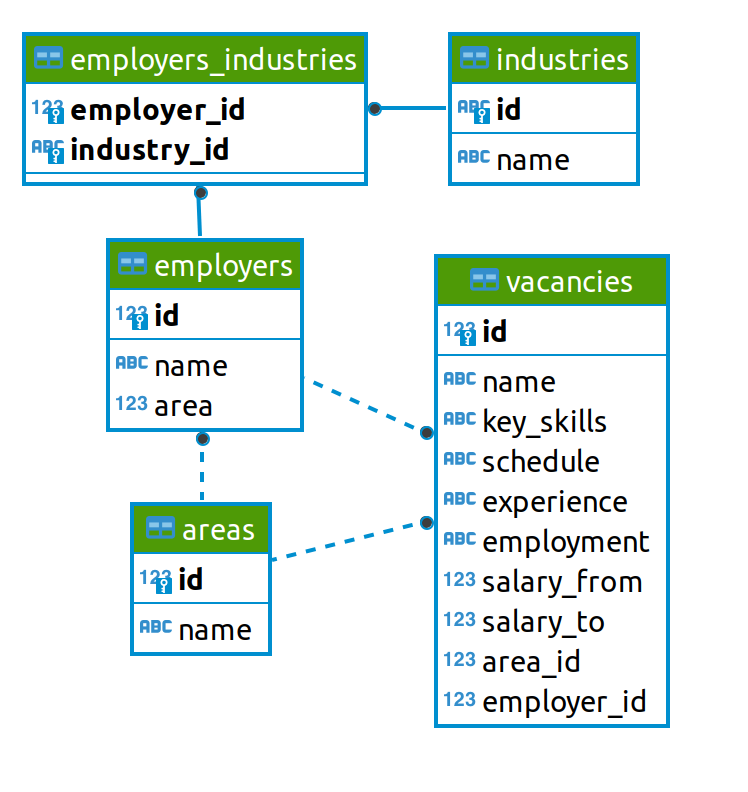
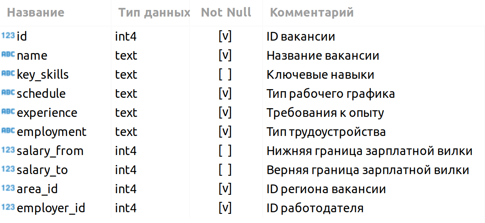
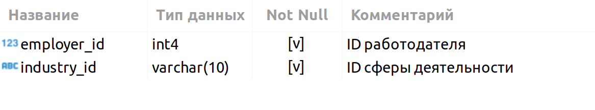

 Представьте, что вы устроились на работу в кадровое агентство, которое подбирает вакансии для IT-специалистов. Ваш первый проект — создание модели машинного обучения, которая будет рекомендовать вакансии клиентам агентства, претендующим на позицию Data Scientist. Сначала вам необходимо понять, что из себя представляют данные и насколько они соответствуют целям проекта. В литературе эта часть работы над ML-проектом называется Data Understanding, или анализ данных.

Наш проект включает в себя несколько этапов:
знакомство с данными;
предварительный анализ данных;
детальный анализ вакансий;
анализ работодателей;
предметный анализ.
Каждая из частей будет состоять из блока практических заданий, которые вам необходимо выполнить в своих Jupyter-ноутбуках, и контрольных вопросов на платформе, которые проверяются автоматически.

Также вам предстоит отправить свой код ментору для код-ревью. Вам будет предоставлен ноутбук-шаблон и требования, согласно которым вы должны оформить своё решение.

Требования к оформлению ноутбука-решения:

Решение оформляется только в Jupyter Notebook.
Решение оформляется в соответствии с ноутбуком-шаблоном.
Каждое задание выполняется в отдельной ячейке, выделенной под задание (в шаблоне они помечены как ваш код здесь). Не следует создавать много ячеек для решения задачи — это провоцирует неудобства при проверке.
Текст SQL-запросов и код на Python должны быть читаемыми. Не забывайте про отступы в SQL-коде.
Выводы по каждому этапу оформляются в формате Markdown в отдельной ячейке (в шаблоне они помечены как ваши выводы здесь).
Выводы можно дополнительно проиллюстрировать с помощью графиков. Они оформляются в соответствии с теми правилами, которые мы приводили в модуле по визуализации данных.
Не забудьте удалить ячейку с данными соединения перед фиксацией работы в GitHub.
Знакомство с данными

Все необходимые таблицы находятся в схеме public базы данных project_sql (именно эту базу вам необходимо указать в параметре dbname при подключении).

Познакомимся с каждой таблицей.

Таблица хранит в себе данные по вакансиям и содержит следующие столбцы:

Зарплатная вилка — это верхняя и нижняя граница оплаты труда в рублях (зарплаты в других валютах уже переведены в рубли). Соискателям она показывает, в каком диапазоне компания готова платить сотруднику на этой должности.

Таблица-справочник, которая хранит код региона и его название.

Таблица-справочник со списком работодателей.

Таблица-справочник вариантов сфер деятельности работодателей.

Дополнительная таблица, которая существует для организации связи между работодателями и сферами их деятельности.

Эта таблица нужна нам, поскольку у одного работодателя может быть несколько сфер деятельности (или работодатели могут вовсе не указать их). Для удобства анализа необходимо хранить запись по каждой сфере каждого работодателя в отдельной строке таблицы.
